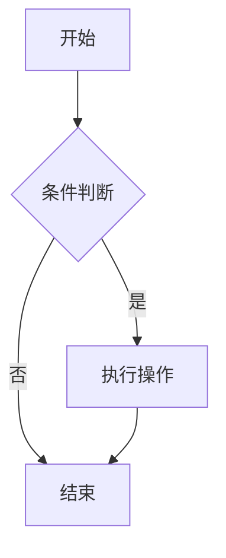

# vue-markdown-stream

> Agent UI Protocol — LLM 可控的流式 Markdown 渲染 + Vue 交互组件协议

[](https://www.npmjs.com/package/@krishanjinbo/vue-markdown-stream)
[](./LICENSE)

在 AI Agent 场景中，将 `:::confirm`、`:::select`、`:::form` 等 Markdown 容器块实时渲染为 Vue 3 交互组件，用户操作通过事件总线回传给宿主应用。

**[完整文档](https://hanlang123.github.io/vue-markdown-stream/) · [在线演示](https://hanlang123.github.io/vue-markdown-stream/demo)**

## 特性

- **流式打字机渲染** — 逐字追加，自动补全未闭合 `:::`、代码围栏和 `$$` 块
- **10 种内置组件块** — alert / card / confirm / select / form / progress / datatable / actions / mermaid / artifact
- **LaTeX 数学公式** — 基于 KaTeX，支持行内 `$...$` 和块级 `$$...$$` 语法
- **Mermaid 图表** — ` ```mermaid ` 代码块自动渲染为 SVG 图表
- **脚注** — 标准 Markdown 脚注语法 `[^1]`
- **Artifact 面板** — 类似 Claude Code 的 Artifact 机制，支持代码/HTML/SVG/文档展示，可复制、下载、折叠
- **事件回传** — AgentEventBus 将用户交互回传给宿主应用，闭环 Agent 流程
- **Props 安全校验** — 白名单 + 黑名单 + 类型转换，防止 LLM 注入
- **完全可扩展** — 通过 props 传入自定义 componentMap 和 propsSchemas
- **功能可配置** — `enableMath` / `enableMermaid` / `enableFootnote` 按需开关
- **轻量** — 基于 `DOMParser` + `h()` VNode，无运行时编译

## 安装

```bash
npm install @krishanjinbo/vue-markdown-stream markdown-it markdown-it-container
```

### 可选依赖

```bash
# LaTeX 数学公式支持（需要引入 KaTeX CSS）
npm install katex

# Mermaid 图表支持
npm install mermaid
```

> KaTeX CSS 需用户自行引入: `import 'katex/dist/katex.min.css'`

## 快速上手

```vue
<script setup lang="ts">
import { computed } from 'vue'
import { MarkdownRenderer, useStreamingText } from '@krishanjinbo/vue-markdown-stream'

const { text, isStreaming, startStream, resetStream } = useStreamingText()
const display = computed(() => isStreaming.value ? text.value + '▍' : text.value)
</script>

<template>
  <button @click="startStream">开始流式输出</button>
  <button @click="resetStream">重置</button>
  <MarkdownRenderer :content="display" />
</template>
```

## Agent 交互用法

```vue
<script setup lang="ts">
import { MarkdownRenderer, useAgentEvents } from '@krishanjinbo/vue-markdown-stream'

const { createHandler, serializeToMessage } = useAgentEvents()

const handleAction = createHandler(async (payload) => {
  const message = serializeToMessage(payload)
  // 发送给 Agent API...
})
</script>

<template>
  <MarkdownRenderer :content="text" @agent:action="handleAction" />
</template>
```

## Markdown 语法

```markdown
::: alert info
**提示**：这是一个 Info 告警块。
:::

::: confirm action="delete" level=danger
确认删除？此操作不可撤销。
:::

::: progress value=73 max=100 status=active
正在处理... 73/100
:::

::: actions
- 查看进度
- 生成报告
- 导出数据
:::

::: artifact type="code" lang="python" title="Hello World"
print("Hello, World!")
:::

::: artifact type="html" title="预览卡片"
<div style="padding:16px; background:#f0f9ff; border-radius:8px;">
  <h3>Hello Artifact!</h3>
</div>
:::
```

### 数学公式

```markdown
行内公式：$E = mc^2$

块级公式：

$$
\int_{-\infty}^{\infty} e^{-x^2} dx = \sqrt{\pi}
$$
```

### Mermaid 图表

````markdown

````

### 脚注

```markdown
这是一段带脚注的文字[^1]，还有另一个脚注[^note]。

[^1]: 这是第一个脚注的内容。
[^note]: 这是命名脚注的内容。
```

### 功能开关

```vue
<MarkdownRenderer
  :content="text"
  :enable-math="true"
  :enable-mermaid="true"
  :enable-footnote="true"
/>
```

## 渲染架构

```
流式 chunk
  → autoCloseContainers()       补全未闭合 :::、```、$$ 块
  → markdown-it + plugins       footnote / katex / container / fence
  → 输出含 <vue-block> 的 HTML  mermaid 代码块 → <vue-block data-component="MermaidBlock">
  → DOMParser                   HTML → DOM 树
  → PropValidator               Props 白名单校验 + 清洗
  → h() VNode 构建              <vue-block> → Vue 组件 VNode + 事件绑定
  → AgentEventBus               组件事件 → 宿主应用回调
  → MarkdownRenderer            渲染输出
```

## 本地开发

```bash
npm install
npm run dev          # http://localhost:5173/
npm run build        # App 构建
npm run build:lib    # 库构建（dist/）
npm run docs:dev     # 文档本地预览
npm run docs:build   # 文档构建
```

## License

[MIT](./LICENSE) © 2026 hanlang123
